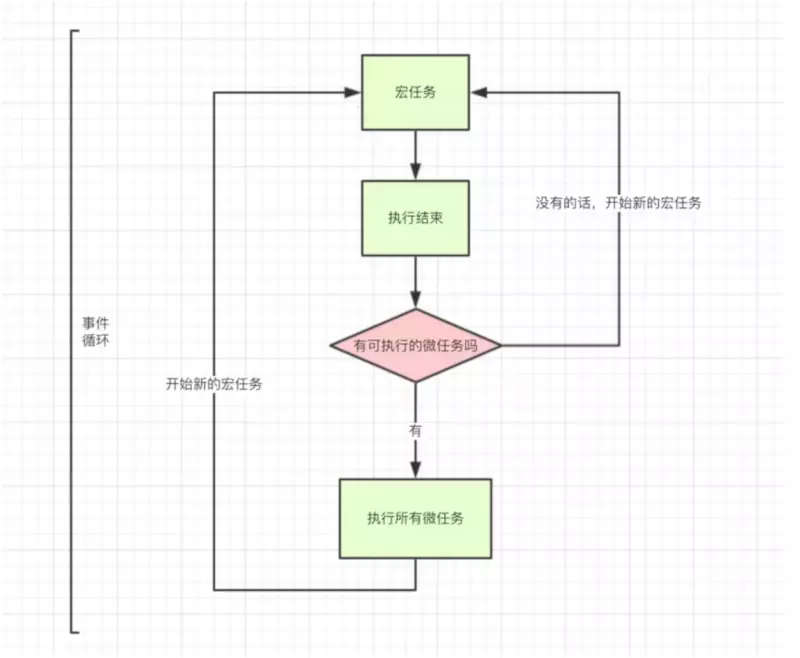
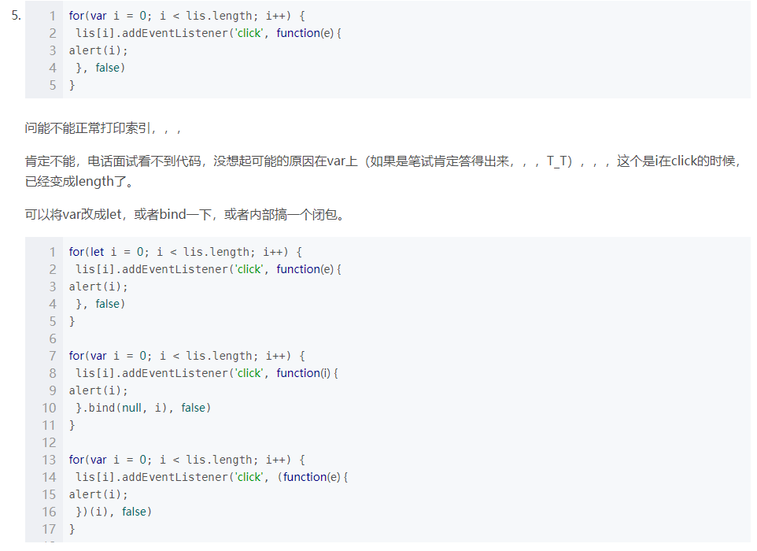

#### 如何判断是数组

- 注意不能用typeof，typeof数组返回object
- ES5的`Array.isArray`方法
- `xxx instranceof Array`（instanceof是二元操作符，而typeof是一元）
- `xxx.constructor == Array` instanceof的原理也是检测构造函数
- 原型链。`Object.prototype.toString.call(arr)==='[object Array]'`

#### 性能优化

白屏时间：从刚进入到开始渲染body

首屏时间：铺满屏幕加载时间

性能调试方法：Chrome开发者工具Performance分析工具，可以具体看到哪个函数

优化：

- JS、CSS阻塞，JS可以放body后面，或者
- 图片优化，雪碧图
- JS、CSS压缩（minify）

#### 雪碧图的使用

```css
background-position：-xpx -ypx;
```

#### 计算页面渲染时间

```html
<head> 
<script type="text/javascript">
var start = new Date().getTime(); 
window.onload = function(){ 
  var time="加载本页耗时 "+(new Date().getTime()-start) +" 毫秒"; 
}
</script> 
</head>
```

#### var，let，const

- var：**声明提升**；如果直接上级是window，会绑在window
- let：块级作用域，不提升
- const：常量，不能直接修改，但其中内容不保证常

- 暂时性死区：

  ```js
  var a = 100 // 改成let也一样
  if (1) {
      a = 10
      // 在当前块作用域中存在a使用let/const声明的情况下，给a赋值10时，只会在当前作用域找变量a
      // 而这时，还未到声明时候，所以控制台Error: a is not defined
      let a = 1
  }
  ```

#### 箭头函数相关问题

- 是一个匿名函数
- 优雅的语法，如果纯return可以省略return
- 箭头函数没有自己的this，也就没有arguments
- 箭头函数不具备Function的原型
- 但是箭头函数有call和apply，但是指定this的功能失效
- 箭头函数不能被new，即不能做构造函数

#### fetch

与XHR不同的异步请求方式。也是基于promise。

- fetch接受到错误HTTP状态码时不会reject
- fetch不会发送cookies，也没有跨域cookies
- response.json(), .text(), .blob()

#### Promise相关问题

- .then可以传onFullfilled和onFail两个回调，现在习惯只传前者，然后在.catch统一处理失败情况

- 三个状态：pending，resolved（fulfilled），rejected

- 手写Promise思路

  - 有一个变量记录当前状态

  - 构造函数收executor，内部立即执行`executor(resolve, reject)`，其catch也reject

  - then绑在原型链上，内部根据状态调用回调

    ```js
    Promise.prototype.then = function (onFulfilled, onRejected)
    ```

  - 接下来考虑异步，then时如果还在pending，就把回调寄存起来

- async await语法糖

  - 函数async，内部才能await
  - await一个Promise，可以直接赋返回值`a=await xxx()`

#### 为什么JS要有闭包

- 实现私有域
- 避免变量污染
- …

#### 构造函数有return怎么办

如果return的值是基本数据类型的话，则忽略return的值，直接返回实例化的对象；

如果return的值是引用类型的话，则不再返回实例化的对象，而是直接返回return返回的引用类型的值。

#### 垃圾回收

- 引用计数策略

  跟踪记录每个值被引用的次数

- 标记清除策略

  当变量进入执行环境的时候标记为"进入环境",离开执行环境的时候标记为"离开环境"

手工解除：xxx=null

#### 隐式类型转换规则

- ++，--：Number转为数字
- isNaN：先Number转，再进行isNaN
- +：字符串拼接，-：字符串不能拼接
  - 1+"1"=11
  - 1-"1"=0

#### 设置cookie有效期

```js
document.cookie = name + "=" + escape(value) + ";expires=" + exp.toGMTString();
```

#### 事件循环

遇到同步任务直接执行,遇到异步任务分类为宏任务(macro-task)和微任务(micro-task)。

宏任务：整体的*Scrip*t *setTimeout* *setInterval*
微任务：*Promise* *process.nextTick*

##### 有微则微，无微则宏



#### Promsie与setTimeout优先级

可以看出Promise比setTimeout()先执行。

因为Promise定义之后便会立即执行，其后的.then()是异步里面的微任务。

而setTimeout()是异步的宏任务。

#### 移动端开发

- touch事件主要用到touchstart，touchmove，touchend
- 300ms问题
  - 禁止页面缩放（user-scalable）
  - 添加viewpoint meta标签声明已经适配


#### SSR服务端渲染

服务器返回HTML源码。首屏SSR可以SEO。

PHP、JSP、ASP这种前后端不分离的也是SSR的一种。

#### 对JS的了解

- 灵活的脚本语言，例如可以直接绑属性等等
- 在其他运行时的支持下已经渗入后端、桌面开发等领域（node, electron）
- WebGL图形学开发

#### 实现一个HTTP请求库，设计思路

- 浏览器兼容
- xhr，异步，Promise支持，链式调用，aysnc await
- 头、拦截器、配置项

#### 数组操作

- slice 切片
- splice 删除
- shift 删除第一个并返回
- pop 删除最后一个并返回
- push 最后推入
- unshift 向数组的开头添加一个或更多元素
- join 把数组中的所有元素放入一个字符串（参数为separator）
- concat() 方法用于连接两个或多个数组

#### content-type的类型，你用过那些

application/x-www-form-urlencoded：最常见的 POST 提交数据的方式了。浏览器的原生 form 表单，如果不设置 enctype 属性，

multipart/form-data：使用表单上传文件时，必须让 form 的 enctyped 等于这个值。

application/json

text/plain

image/jpeg, png ...

#### enctype

form的属性，说明在发送到服务器之前应该如何对表单数据进行编码

#### 闭包，作用域



#### 继承

- 组合继承

  ```js
  function Animal(_name) {
        this.name = _name
      }
      Animal.prototype.sayName = function() {
        console.log(this.name)
      }
      function Cat(_name, _tailLen) {
        // 1 - 调用 super 的构造
        Animal.call(this, _name) // 第二次调用构造
        this.tailLen = _tailLen
      }
      // Cat.prototype = Animal.prototype // 会造成浅拷贝
      // 2 - 连接原型，修复构造函数
      Cat.prototype = new Animal() // 第一次调用构造，目的就是为了得到父类的原型
      Cat.prototype.constructor = Cat
  ```

- 寄生组合式

  ```js
      function createObject(proto) {
        // 将 new xxx() 换成一个现有的对象（比如一个实例）
        function F() {}
        F.prototype = proto
        return new F()
      }
      function inheritPrototype(subType, superType) {
        // 只是为了拷贝的原型，其他不感兴趣
        let p = createObject(superType.prototype)
        p.constructor = subType
        subType.prototype = p
      }
  
      function Animal(_name) {
        this.name = _name
      }
      Animal.prototype.sayName = function() {
        console.log(this.name)
      }
      function Cat(_name, _tailLen) {
        Animal.call(this, _name)
        this.tailLen = _tailLen
      }
      inheritPrototype(Cat, Animal)
  ```

#### 用关键字new创建对象，new都做了什么

- 创建一个空对象，将它的引用赋给 this，继承函数的原型
- 通过 this 将属性和方法添加至这个对象
- 最后返回 this 指向的新对象，也就是实例

```js
// ES5构造函数
let Parent = function (name, age) {
    //1.创建一个新对象，赋予this，这一步是隐性的，
    // let this = {};
    //2.给this指向的对象赋予构造属性
    this.name = name;
    this.age = age;
    //3.如果没有手动返回对象，则默认返回this指向的这个对象，也是隐性的
    // return this;
};
const child = new Parent();
```


#### 数组去重

- ES6中的set：`Array.from(new Set(arr))`，或者`[...NEW Set(arr)]`

  问题：去不掉重复的{}

- 双重for，splice重复项

  问题：效率太差O(n²)

- indexOf，`a.indexOf(b[i]) === -1`就push

#### 前端跨域

纯前端实现：

- JSONP：利用script标签本身的跨域能力，载入后会立即执行
- 对于主域相同而子域不同的情况下，可以通过设置document.domain降域

CORS实现：

- 一般情况下服务端配合设置Access-Control-Allow-Origin即可
- 如果要带cookie，前端xhr.withCredentials=true，后端Access-Control-Allow-Credentials

#### this指向

this的最终指向的是那个调用它的对象

在严格版中的默认的this不再是window，而是undefined

#### ES6新特性了解哪些

- let，没有变量提升，块级作用域（花括号）
- 反引号模板字符串
- 箭头函数（没有自己的this）
- 三点运算符就地展开
- class语法糖
- Promise

#### 防抖与节流

在前端开发的过程中，我们经常会需要绑定一些持续触发的事件，如 resize、scroll、mousemove 等等，但有些时候我们并不希望在事件持续触发的过程中那么频繁地去执行函数。通常这种情况下我们怎么去解决的呢？一般来讲，防抖和节流是比较好的解决方案。

- 防抖：触发事件后在 n 秒内函数只能执行一次，如果在 n 秒内又触发了事件，则会重新计算函数执行时间

  ```js
  function debounce(func, wait) {
      let timeout;
      return function () {
          let context = this;
          let args = arguments;
          if (timeout) clearTimeout(timeout);
          timeout = setTimeout(() => {
              func.apply(context, args)
          }, wait);
      }
  }
  content.onmousemove = debounce(count, 1000);
  ```

- 节流：连续触发事件但是在 n 秒中只执行一次函数

  ```js
  function throttle(func, wait) {
      let timeout;
      return function() {
          let context = this;
          let args = arguments;
          if (!timeout) {
              timeout = setTimeout(() => {
                  timeout = null;
                  func.apply(context, args)
              }, wait)
          }
      }
  }
  ```

#### 懒加载思路

- 占位图占位
- 监听scroll，检查图片DOM是否在可视范围，落入可视范围就加载（new Image后替换可避免一行一行刷出）
- scroll监听可以设置阈值节流
- 视区判断：offsetTop（图片距离顶部）-scrollTop（scroll距离顶部）=clientHeight（固定值）

#### 正则匹配QQ号

`^[1-9][0-9]{5,10}`

#### JS的事件循环机制

JS是单线程语言，为了协调各种行为，必须使用event loop。

#### 强缓存和协商缓存

对前端静态资源做一些运维配置，其中，gzip和设置缓存是必不可少的。

缓存的优点：

- 减少了不必要的数据传输，节省带宽，减少服务器的负担，提升网站性能
- 加快了客户端加载网页的速度

两种缓存：

- 强缓存：直接使用本地的缓存，不用跟服务器进行通信。

  相关header：expires，cache-control: max-age

- 协商缓存：将资源一些相关信息返回服务器，让服务器判断浏览器是否能直接使用本地缓存，整个过程至少与服务器通信一次。

  相关header：Last-Modified/If-Modified-Since，Etag（实体tag）


#### JS判断类型

- typeof xxx

- xxx instanceof yyy

- Object.prototype.toString.call(xxx)

  ```
  字符串 [object String]
  构造函数 [object Object]
  对象 [object Object]
  数组 [object Array]
  布尔值 [object Boolean]
  数字 [object Number]
  ```

#### addEventListener

可以叠加。

#### cookie, sessionStorage, localStorage

localStorage和sessionStorage一样都是用来存储客户端临时信息的对象。目前浏览器的实现只能存储字符串对象。（`setItem(xxx, xxx)`）

- sessionStorage的生命周期通常是一个标签页，刷新不会丢失
- localStorage的生命周期是永久，除非清除否则不会消失

#### cookie, session

cookie在本地浏览器，session在服务器。两者结合使用，服务器分发sessionid给客户端形成会话。

#### 事件冒泡、事件捕获

- 捕获型事件(event capturing)：事件从最不精确的对象(document 对象)开始触发，然后到最精确(也可以在窗口级别捕获事件，不过必须由开发人员特别指定)

- 冒泡型事件：事件按照从最特定的事件目标到最不特定的事件目标(document对象)的顺序触发。

addEventListener第三个参数所以存在且为true时，事件是捕获传递触发的

阻止冒泡：event.stopPropagation()。return false会阻止默认行为，即把事件本身也阻止了。

不冒泡事件：load、unload；focus、blur

#### JS基本数据类型

六大数据类型：number, string, object, boolean, null, undefined

Object包含了Array和Function

typeof对象、数组都返回object，函数返回function，其他返回本身

#### BOM和DOM

BOM 是 各个浏览器厂商根据 DOM 在各自浏览器上的实现。

DOM（文档对象模型）是 HTML 和 XML 的应用程序接口（API）。

BOM 主要处理浏览器窗口和框架。window 是 BOM 对象，而非 js 对象。

#### 正则实现前后trim

```js
String.prototype.ltrim = function(){
	return this.replace(/(^\s*)/g,"");
}
String.prototype.rtrim = function(){
 	return this.replace(/(\s*$)/g,"");
}
```

g匹配：global匹配，尽量消耗字符。

#### call和apply

每个function实例都有call、apply属性。作用是改变this指向后执行函数。

#### JS深拷贝

基本数据类型自动深拷贝，引用数据类型不会深拷贝。实现深拷贝的方法：

- `JSON.parse(JSON.stringify(xxx))`

  问题：不可以拷贝 undefined ， function， RegExp 等

- `Object.assign(target, source)`

  问题：多层嵌套时，下面的还是只拷贝了引用

  注：该方法可用于对象合并

- 递归拷贝，如果是对象...如果是数组...如果是null...如果是RegExp...

#### polyfil

Polyfill 是一块代码（通常是 Web 上的 JavaScript），用来为旧浏览器提供它没有原生支持的较新的功能。也就是通常说的 Shim。

#### 轮播图实现思路

- 利用位移（dom.style.left）的改变实现图片的变动

- 想办法让图片在同一行显示（利用浮动）

- 无缝自动无限轮播？

#### Symbol

用于类似于枚举的功能。考虑定义：

```js
const Types = {
    xxxType: "blabla",
    yyyType: "alaala"
}
```

指代Types.XXX时与""内无关，只要不同即可。使用Symbol后可写为：

```js
const Types = {
    xxxType: Symbol(),
    yyyType: Symbol("Comment only, useless content")
}
```

来明晰语意。Symbol 本质上是一种唯一标识符。`Symbol`函数前不能使用`new`命令。这是因为生成的Symbol是一个原始类型的值。由于Symbol值不是对象，所以不能添加属性（**原始类型不能添加属性！**）。

有时，我们希望重新使用同一个Symbol值，`Symbol.for`方法可以做到这一点。

Symbol数据类型的另一特点是隐藏性，以Symbol作key需要加[...]符号。for···in，Object.keys()不能访问。

#### 浏览器跨标签页通信

- localStorage.setItem，另一页面监听storage事件
- 放入本地cookie，另一页面轮询

#### babel原理

- ES6代码输入 ==》 babylon解析 ==》 得到AST
   ==》 plugin用babel-traverse对AST树进行遍历转译 ==》 得到新的AST树
   ==》 用babel-generator通过AST树生成ES5代码
- 如果要自行配置转译过程中使用的各类插件，那太痛苦了，所以babel官方帮我们做了一些预设的**插件集**，称之为**preset**，这样我们只需要使用对应的preset就可以了：
  - es2015
  - es2016
  - es2017

#### SVG

矢量图，使用XML描述

#### WebP

图片格式，高度压缩-

#### 图片先模糊后清晰

img标签的lowsrc属性

#### typescript装饰器

装饰器是一种特殊类型的声明，它能够被附加到类声明，方法， 访问符，属性或参数上。 装饰器使用 @expression这种形式，expression求值后必须为一个函数，它会在运行时被调用。

#### console.log(typeof null, typeof [])

typeof null是object

typeof []是object（准确的说类型是[object Array]）

