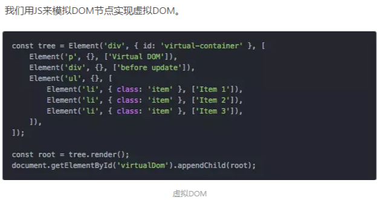

#### Vue带来的变革

- 专注于数据，数据驱动，无需手工修改DOM
- 工程化、模块化（单文件组件）
- SPA的流行

#### Vue的渲染原理

- 把模板编译成相应的render函数
- 把Vue实例挂载到托管的DOM上，形成VNode
- 数据发生改变时就会触发render函数重新渲染

#### computed和watch的区别

watch是调用函数，可以做其他处理；computed只是获取值

#### 虚拟DOM

简而言之是用JS写DOM树结构。



若一次操作中有10次更新DOM的动作，虚拟DOM不会立即操作DOM，而是将这10次更新的diff内容保存到本地一个JS对象中，最终将这个JS对象一次性attach到DOM树上，再进行后续操作，避免大量无谓的计算量。

#### diff算法

Diff算法的作用是用来计算出 **Virtual DOM** 中被改变的部分，然后针对该部分进行原生DOM操作，而不用重新渲染整个页面。

传统比较两棵树需要O(n^3)时间复杂度（Tree edit distance算法，2011年Pawlik等人优化到n3复杂度）

虚拟DOM复杂度O(n)，因为只做平层的比较。


**比较只会在同层级进行, 不会跨层级比较。**
比较后会出现四种情况：
1、此节点是否被移除 -> 添加新的节点 
2、属性是否被改变 -> 旧属性改为新属性
3、文本内容被改变-> 旧内容改为新内容
4、节点要被整个替换 -> 结构完全不相同 移除整个替换

#### jQuery相关

- $('div')，返回所有div组成的对象

- $().click(function () {$().hide()})隐藏某个DOM元素

- JavaScript window.onload 事件和 jQuery ready 函数之间的主要区别是，前者除了要等待 DOM 被创建还要等到包括大型图片、音频、视频在内的所有外部资源都完全加载；jQuery ready() 函数只需对 DOM 树的等待。使用 jQuery $(document).ready() 的另一个优势是你可以在网页里多次使用它（可以自动堆叠），浏览器会按它们在 HTML 页面里出现的顺序执行它们，相反对于 onload 技术而言，只能在单一函数里使用（只能绑一次）。

- 如何找到所有 HTML select 标签的选中项？$(``'[name=NameOfSelectedTag] :selected'``)

- attr() 方法被用来提取任意一个HTML元素的一个属性的值

  ```
  alert($(this).attr('href'));
  ```

  ```
  $(this) 返回一个 jQuery 对象，你可以对它调用多个 jQuery 方法，比如用 text() 获取文本，用val() 获取值等等。而 this 代表当前元素，它是 JavaScript 关键词中的一个，表示上下文中的当前 DOM 元素。你不能对它调用 jQuery 方法，直到它被 () 函数包裹，例如 $(this)。
  ```

#### Vuex

全局状态管理与共享。集中式储存管理 Vue 应用中所有组件的状态。应用：购物车。

- state：基本数据

- getters：类似于计算属性。访问： `this.$store.getters.xxx`

- mutations：变更状态。需要`commit('xxx')`，可以传参

  mutation必须是同步函数，因为**在回调函数中进行的状态的改变都是不可追踪的**

- actions：提交一系列mutation。每个action可以接收`xxx({commit,state},yyy)`，可以是异步的

调用mutations内方法时，需要this.$store.commit('反射')

#### Vue生命周期

- beforeCreate 创建前
- **created 创建后**
- beforeMount 载入前
- **mounted 载入后**
- beforeUpdate 更新前
- **updated 更新后**
- beforeDestroy 销毁前
- **destroyed 销毁后**

#### Vue指令

- v-html：渲染文本（能解析 HTML 标签）
- v-text：渲染文本（统统解析成文本）
- v-bind：绑定数据（语法糖:）
- v-model：绑定模型（双向绑定）
- v-on：绑定事件（语法题@）
- v-if v-show：条件渲染。v-show仅仅控制元素的显示方式，通过display属性的none；v-if会控制这个DOM节点的存在与否。
- v-once：只渲染该元素或组件一次

#### Vue前端跨域


#### 优化首屏加载速度

- 组件按需加载
- gzip
- 懒加载、占位图、雪碧图
- JS的uglify、minify压缩，min版本

#### Vue-router相关

模式：

- hash：URL中带#号。使用URL的hash值来作为路由。支持所有浏览器。
- history：HTML5 History模式，需要浏览器支持。URL中无#号，更美观。

#### Vue获取真实ref

设置ref="xxx"，利用this.$refs

#### Vue的双向绑定原理

- Object.defineProperty劫持各个属性的getter和setter，从而在数据变动后触发更新
- 属性维护一个Dep列表，自身发生更新时notify订阅者进行更新

双向绑定的实现关键：ES5的Object.defineProperty(obj, prop, descriptor)劫持getter和setter，观察者模式（发布订阅模式）

```js
var obj = {};
var val = 'zhao';
Object.defineProperty(obj, 'val', {
    get: function () {
        return val;
    },
    set: function (newVal) { 
        val = newVal;
        document.getElementById('a').value = val;
        document.getElementById('b').innerHTML = val;
    }
});
document.addEventListener('keyup', function (e) {
    obj.val = e.target.value;
})
```

#### Vue和React异同点

相同：

- 使用虚拟DOM
- 可以组件化开发

不同：

- Vue采用单文件组件，模板、CSS、逻辑写在一起；React用JSX语法，在JS里写HTML
- Vue的最佳实践更统一（如vue-router、vuex）；React的选择更多元

#### mvvm架构的特点

Model-View-ViewModel。VM：ViewModel（Model与View之间核心枢纽，比如Vue.js）

- Model与ViewModel之间：ajax双向通信

- ViewModel与View之间：数据双向绑定

#### Vue组件传值

- 父->子：

  父亲把属性bind进去，孩子用props接收

- 子->父：

  父亲准备好v-on事件捕获，孩子用emit激发事件

#### webpack

功能：模块打包

四大概念：

- entry：入口点，从这个主文件开始找到你项目当中的所有依赖的文件，使用loaders来处理它们
- output
- loader：转换非JS文件，如ts, sass, vue
- plugin：插件，扩展其他功能（与构建先关），如HtmlWebpackPlugin实现自动刷新

#### Vue.nextTick

在下次 DOM 更新循环结束之后执行延迟回调。在修改数据之后立即使用这个方法，获取更新后的 DOM。

#### vue prevent

例如表单，指定v-on.submit.prevent可以阻止默认的提交事件