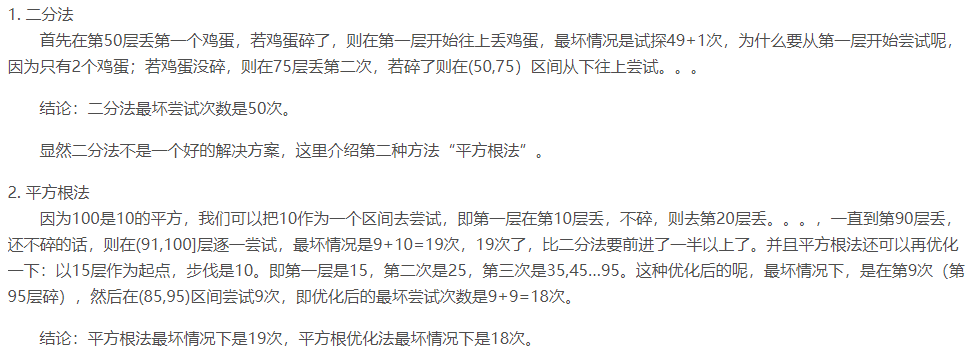

#### 现有60根型号相同的圆钢管，堆放成一个正三角形垛，要使剩下的钢管尽可能少,则剩下的钢管数是？

#### 一个5\*4的矩阵，有多少个长方形？（正方形也算是长方形）

长取两点，宽取两点。Sum=C6_2 * C5_2 = 15 * 10 = 150

#### 将1,2,3,......,99,100任意排列成一个圈，相邻两数的差的绝对值求和最多为____。

最大排列为100 1 99 2 98 3.....51 49 50，所以和为99+98+97+..+1+(100-50)因为是一个圈所以，100和50相接，所以等于5000。

#### 七只老鼠，一百瓶药水，其中有一瓶是毒药，毒发时间为一天，使用一天时间检测出毒药？

#### 有两个鸡蛋，如何最快的试出100层楼中刚好那一层扔下鸡蛋会碎？

