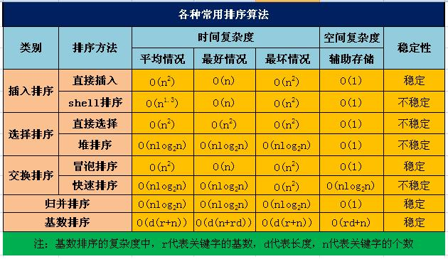

#### 小程序

结构：WXML、WXSS、JS、JSON

- 小程序data没有自动同步，需要this.setData
- 小程序鉴权：appid、openid、鉴权中心；用户有unionid
- 屏幕宽度750rpx
- 还有一些钩子

#### flutter

基于Dart语言（带火了Dart），一处开发多处使用（安卓+IOS）（混合开发）

#### Serverless

“构建或使用一个微服务或微功能来响应一个事件”，做到当访问时，调入相关资源开始运行，运行完成后，卸载所有开销，真正做到**按需按次计费**。这是**云计算**向纵深发展的一种自然而然的过程。

#### 抓包

burpsuite通过代理、wireshark监听硬件

#### 设计模式

- 简单工厂：工厂根据参数的不同返回不同类的实例，使用者不关心如何创建对象

- 单例模式：确保某一个类只有一个实例，而且自行实例化并向整个系统提供这个实例

  实现：私有的构造函数，自身暴露getInstance方法

  懒汉式（只有当调用getInstance的时候才去初始化单例）；饿汉式（类一旦加载，就把单例初始化完成）

  显然懒汉式可能出现线程安全问题

- 适配器模式：将一个接口转换成客户希望的另一个接口

- 生产者消费者模式

- 观察者模式：定义对象间的一种一对多依赖关系，使得每当一个对象状态发生改变时，其相关依赖对象皆得到通知并被自动更新（发布-订阅模式）

#### HTTPS为什么更安全

HTTPS是在HTTP上建立SSL加密层对传输数据进行加密。先和SSL（安全套接层）通信，再由SSL和TCP通信。

对称加密。（非对称加密效率很低）

- Client发HTTPS请求到服务器（多为443端口）
- Server返回公钥证书（可靠CA颁发）
- Client验证公钥证书，生成对称密钥，用公钥加密，发给Server
- Server解密获得对称密钥
- 下面就使用这个对称密钥进行数据的加解密

#### 常用排序算法



- 插入排序：类似于扑克到手的排序过程

- 选择排序：每次选一个应该接到当前末尾的

- 冒泡排序：比较两个相邻的元素，将值大的元素交换到右边

  ```cpp
  for (i = 0; i < len - 1; i++)
  	for (j = 0; j < len - 1 - i; j++)
  ```

  优化：第二层设置flag，如果没有发生交换就说明已经有序

- 快速排序：low、high指针，把比基准数大的都放在基准数的右边，小的放在基准数的左边，递归

  最坏情况：每次划分只能将序列分为一个元素与其他元素两部分

  最好情况：Partition函数每次恰好能均分序列

#### 尾递归是什么

尾递归，比线性递归多一个参数，这个参数是上一次调用函数得到的结果；
所以，关键点在于，尾递归每次调用都在收集结果，避免了线性递归不收集结果只能依次展开消耗内存的坏处。

```python
def recsum(x):
  if x == 1:
    return x
  else:
    return x + recsum(x - 1)
def tailrecsum(x, running_total=0):
  if x == 0:
    return running_total
  else:
    return tailrecsum(x - 1, running_total + x)
```

递归发生位置在函数体尾，经过编译器优化可以不压栈保存各次状态。

#### CSRF

跨站点请求伪造。攻击者盗用了你的身份，以你的名义发送恶意请求。

>  用户未退出网站A之前，访问网站B；网站B接收到用户请求后，发出一个请求要求访问第三方站点A的某些带权限接口；浏览器根据网站B的请求，在用户不知情的情况下携带Cookie信息，向网站A发出请求（例如表单提交）
>

防御：

- 验证Referer（它记录了该 HTTP 请求的来源地址）

- csrf_token

  第一步：后端随机产生一个token，把这个token保存在SESSION状态中；同时，后端把这个token交给前端页面；（前端放在cookies中可能有安全问题）

  第二步：下次前端需要发起请求（比如发帖）的时候把这个token加入到请求数据或者头信息中，一起传给后端；

  第三步：后端校验前端请求带过来的token和SESSION里的token是否一致；

#### Nginx的应用

- 最基本的是类似于Apache搭建普通的HTTP服务器

- 作为反向代理服务器（proxy_pass属性）

  真实的服务器不能直接被外部网络访问，所以需要一台代理服务器，这就是反向代理。

  正向代理是代理客户端（出路代理），反向代理是代理服务器（入路代理）。

- 多服务器负载均衡（upstream分配）

#### SQL注入和防御

sql注入就是闭合原先的sql语句并拼接上攻击者想要执行的sql语句

```sql
select name from user where userid=xxx and password=xxx or 1=1
```

防御方法：

- 避免将用户提供的输入直接放入SQL语句中；最好使用准备好的语句和参数化查询
- 使用ORM框架（如MyBatis）
- 不要把数据库字段、表名相关的错误信息返回前端
- PHP有magic_quotes_gpc

#### HTTP常用header

- content-type：内容的MIME，如text/plain，application/json，multipart/form-data
- user-agent：即UA，通常表明用什么浏览器/客户端
- referer：先前的网页
- access-control-allow系列：用于处理跨域


#### TCP三次握手四次挥手

三次握手：

- 客户端SYN
- 服务器SYN+ACK
- 客户端ACK

四次挥手：

- 客户端连接释放报文
- 服务器确认报文
- 客户端等待服务器连接释放报文，此时服务器发送剩余数据，这也就是为什么不能三次挥手的原因
- 客户端确认

#### 线程和进程

进程是程序的一次执行过程，线程是CPU调度和分派的基本单位。一个进程可以包括多个线程。

#### 进程通信

- 管道pipe
- 命名管道FIFO
- 消息队列
- 信号量（计数器，用于实现进程间的互斥与同步）
- 共享内存（通常结合信号量使用）

#### 海量数据找出现次数最多

有一个1G大小的一个文件，里面每一行是一个词，词的大小不超过16字节，内存限制大小是1M。返回频数最高的100个词。

类似于归并排序的思想。

1. 分而治之/hash映射：顺序读文件中，对于每个词x，取hash(x)%5000，然后按照该值存到5000个小文件（记为x0,x1,...x4999）中。这样每个文件大概是200k左右。如果其中的有的文件超过了1M大小，还可以按照类似的方法继续往下分，直到分解得到的小文件的大小都不超过1M。
2. hash统计：对每个小文件，采用trie树/hash_map等统计每个文件中出现的词以及相应的频率。
3. 堆/归并排序：取出出现频率最大的100个词（可以用含100个结点的最小堆），并把100个词及相应的频率存入文件，这样又得到了5000个文件。最后就是把这5000个文件进行归并（类似与归并排序）的过程了。

#### 天平找假币

使用天平3次，从9个乒乓球找唯一1个轻的废品

> 123vs456
>
> 平衡：789中，7vs8，7vs9
>
> 不平衡：不妨设123>456，若783>956则次品在356中，此时5vs6；若783<956则次品在356；若783=956则次品在124

#### 70%的人喜欢足球，80%的人喜欢篮球，同时喜欢足球和篮球的人有多少

最多显然是70%。

30不爱足球，假设全爱篮球，就扣掉了80中的30，剩余50爱篮球又爱足球。

#### 输入网址后发生了什么

- 把网址解析成IP地址
  - 先查询本地hosts文件映射
  - 再查询DNS服务器
- 与目标服务器进行TCP连接
- 发送HTTP请求
- 服务器处理请求，返回响应
- 接收响应（网页），浏览器渲染

#### 计算机网络n层模型


#### TCP

传输控制协议，是一种面向连接的、可靠的、提供拥塞控制的传输层通信协议。

#### UDP

用户数据报协议，无连接，不可靠传输，不使用流量控制和拥塞控制。

#### TCP为什么是三次握手四次挥手

- 三次握手

  为了实现可靠传输，发送方和接收方始终需要同步（SYN）序号（SEQ)。 三次握手的过程即是通信双方相互告知序列号起始值， 并确认对方已经收到了序列号起始值的必经步骤。如果只是两次握手， 至多只有连接发起方的起始序列号能被确认， 另一方选择的序列号则得不到确认。

- 四次挥手

  TCP的连接是全双工的，所以连接的拆除需要单独将两个通道分别拆除。仅拆除一个时还有接收另一个方数据的能力。四次挥手主要做了：

  - A说没有数据要发了
  - B说我不收了
  - B说没有数据要发了
  - A说我不收了

当然协议没有100%可靠的。

#### 7：45时针分针角度

时针一小时30度，一分钟0.5度。分针1分钟6度。

$(7*30+45*0.5)-45*6=-37.5$

#### 浏览器渲染页面过程

- 解析HTML，构建DOM
- 解析CSS，构建CSSOM（浏览器默认样式+用户样式）
- 在此过程中，如果遇到JS脚本，则引入并加载。所以把JS放在页脚可以优化性能。
- 构建RenderTree（DOM树和CSSOM树综合）
- 根据渲染树计算各部件布局，绘制到浏览器窗口

重绘Repaint（局部更新）与重排Reflow（结点几何属性变化，如display隐藏，则其他元素可能都需要重新布局）

减少重排：

- 离屏重绘（display: none）
- 一次性集中改变样式（设定一个class）

#### 统计文章中出现次数最多的单词

- map

- 字典树：充分利用公共前缀

  - 根节点不包含字符，除根节点外的每一个子节点都包含一个字符

  - 从根节点到某一节点。路径上经过的字符连接起来，就是该节点对应的字符串

  - 每个节点的所有子节点包含的字符都不相同

#### 大数加法手写

```cpp
HugeInt add(HugeInt& a)
// add two same-sign numbers
{
    // Pre-process " pos + neg "
    if (a.bit[0] == -1 && bit[0] == 1)
        return (*this).subtract(a.abs());
    // Pre-process " neg + pos "
    if (a.bit[0] == 1 && bit[0] == -1)
        return a.subtract((*this).abs());
    // Pre-process " this + 0 "
    if (a.isZero())	return (*this);
    // Pre-process " 0 + a "
    if ((*this).isZero()) return a;
    // The rest: same sign
    HugeInt res;
    // res's sign is same as this and a
    res.bit[0] = bit[0];
    // plus the number part
    int loopTime = (a.len > len ? a.len : len);
    res.len = loopTime;
    for (int i = 1; i <= loopTime; i++)
    {
        res.bit[i] += (bit[i] + a.bit[i]);
        if (res.bit[i] >= 10)
        {
            res.bit[i+1]++;
            res.bit[i] -= 10;
        }
    }
    // process xxxx9 + xxxx2 carryover
    if (res.bit[res.len+1]) res.len++;
    // return res
    return res;
}
```

#### 50红球50蓝球问题

50个红球和50个篮球，放入两个箱子，怎么样放置才能使拿到红球的概率最大？

两个箱子概率是1/2，选中某个箱子后又有选择的是不是红球的概率，所以最大概率就是一个红球放在一个箱子里，其余的99个球全放到另一个箱子。这样概率=0.5+0.5*（49/99）约等于0.75，这样为最大概率。

#### XSS的原理与防范

跨站脚本攻击。插入恶意脚本，实现对用户浏览器的控制。

- 存储型XSS。例如留言板，提交`<script>alert("xss")</script>`，显示时就发生XSS

  防范：主要靠后端过滤、转义。前端也可以简单校验。

#### HTTP状态码

- 200 OK
- 4xx代码 客户端问题
  - 404 not found
  - 400 bad request 错误的请求（如请求语法不对、请求大小太大）
  - 403 forbidden 权限不足
- 5xx代码 服务器问题
  - 500 internal server error 服务器内部问题
  - 502 Bad Gateway
- 3xx代码 重定向
  - 301 永久重定向
  - 302 临时重定向
  - 304 not modified，前端头带了If-Modified-Since，但资源没有修改过

#### 解释304状态码

服务器认为not modified，只返回头部，告诉浏览器可以使用缓存。

如何知道是否修改：

- If-Modified-Since，设置有效时间
- Etag（实体标签）比对

#### CDN

内容分发网。在用户和服务器之间加一个缓存机制，通过这个缓存机制动态获取IP地址根据地理位置，让用户到最近的服务器访问。

#### JWT鉴权

在SPA中一般不用SESSION鉴权，可用JWT轻量级鉴权。

SESSION鉴权的问题：用户数量大时SESSION太多，管理复杂。

JWT好处：服务器不用维护会话信息，无状态，去中心化。

JWT构成：

- header

  ```bash
  { 'typ': 'JWT', 'alg': 'HS256' } // 加密算法alg可更换，这里只是声明
  ```

- payload 存放附带业务信息，不要添加敏感信息，该部分可在客户端解密（BASE64可解密）

  - 公有项目：sub用户，exp过期时间，iat签发时间，jti唯一标识...
  - 私有项目

- signature

  - header sig - BASE64 header
  - payload sig - BASE64 payload
  - secret 自定义盐

  从而获得`HS256(<hs>.<ps>, <secret>)`=signature

最终，将hs、ps、signature三部分用`.`拼接成字符串，形成最终的JWT。发送信息时在header一并发送该信息对应的JWT。


注意JWT是服务器分发的。

#### twoSum

用map存有没有那个数，下标是多少。复杂度O(n)。

```cpp
class Solution {
public:
    vector<int> twoSum(vector<int>& nums, int target) {
		vector<int> res;
		unordered_map<int, int> mp; // K: num V: pos
		for (int i = 0; i < nums.size(); i++) // init map
			mp[nums[i]] = i;
		for (int i = 0; i < nums.size(); i++)
		{
			int need = target - nums[i];
			if (mp.count(need) && mp[need] != i) // NOT SELF PLUS
			{
				res.push_back(i);
				res.push_back(mp[need]);
				return res;
			}
		}
		return res;
    }
};
```

#### 蓄水池抽样算法

算法的精妙之处在于：**当处理完所有的数据时，蓄水池中的每个数据都是以m/N的概率获得的。**

算法思路大致如下：

1. 如果接收的数据量小于m，则依次放入蓄水池。
2. 当接收到第i个数据时，i >= m，在[0, i]范围内取以随机数d，若d的落在[0, m-1]范围内，则用接收到的第i个数据替换蓄水池中的第d个数据。
3. 重复步骤2。

#### sort打乱数组的可靠性

```js
function shuffle(arr) {
    arr.sort(() => Math.random() - 0.5);
}
```

不能真正随机地打乱数组。以V8引擎为例，对短数组使用的是插入排序，对长数组则使用了快速排序，由于该cmpfn不固定可靠，导致相同数对比较结果都会有不同。

问题关键：针对同一组a、b每次返回的值要相同

改造：将原数据改造为一个对象，原来的值存储在键v中，同时给它增加一个键r，值为一个随机数，然后排序时比较这个随机数。

#### git flow

- 分支划分

  - master

    最近发布到生产环境的代码

  - develop

    主开发分支

  - feature

    功能开发分支，开发完成后合并到develop

  - hotfix

    合并回master和develop，从而在下一版本可以通告修复

  - release

    来自develop，象征develop的在某时刻的快照

- 实操

  - 主持人从master上fork一个develop分支

  - 分工程序员从develop上fork一个feature分支
  - 分工程序员开发好后merge到develop分支，如果可以，消灭自己的feature分支
  - 准备发布时，从develop上checkout一个release分支
  - 清理、测试、文档、代码评审等与功能开发不直接相关的工作全部在release分支完成
  - 符合release标准后，release到master分支，同时同步到develop分支，消灭release分支
  - 有临时小型bug时，不必经历上述严格的过程，基于master创建hotfix分支，修复完成后直接merge到master，同时同步到develop分支

#### WebSocket

网络通信协议。

解决问题：

HTTP协议有一个缺陷：通信只能由客户端发起。这种单向请求的特点，注定了如果服务器有连续的状态变化，客户端要获知就非常麻烦。只能轮询：每隔一段时候，就发出一个询问，了解服务器有没有新的信息。最典型的场景就是**聊天室**（在Java、Python等桌面开发中，聊天室使用Socket实现）。

特性：服务器可以主动向客户端推送信息，客户端也可以主动向服务器发送信息

```js
var ws = new WebSocket('ws://localhost:8080');
webSocket.readyState
webSocket.onopen
webSocket.onclose
webSocket.onmessage(event){ do_something(event.data) }
webSocket.send()
```

#### HTTP 1, 1.1, 2

- HTTP 1.0：短连接
- HTTP 1.1：支持长连接和流水线请求（但是响应是阻塞的，需要按序编排返回）
- HTTP 2.0：二进制传输数据而非文本格式；真正的并发请求（不阻塞的响应）；服务器主动push静态资源（如图片、JS等，注意和WebSocket的区别）
- 扩展：HTTP 3.0：基于UDP
